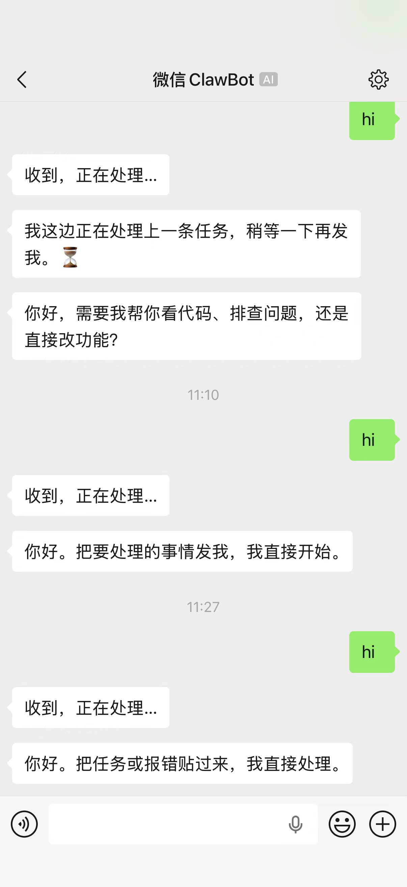

# codecli-channels

把聊天 channel 变成远程 Codex / Claude Code 编码工作台。

[English](README.md) · [简体中文](README.zh-CN.md)

## 先看这里

如果你是第一次接这个项目，不要先在根 README 里找完整接入步骤，直接看对应 channel 的 quickstart：

- [QQ 新人快速上手](quickstart/qq-quickstart.zh-CN.md)
- [飞书新人快速上手](quickstart/feishu-quickstart.zh-CN.md)
- [微信新人快速上手](quickstart/weixin-quickstart.zh-CN.md)

这些 quickstart 才是正式入口，里面会带你完成：

- 去哪里拿凭据或 token
- 最小配置怎么写
- bridge 怎么启动
- 第一条消息怎么验证

## 微信使用参考

如果你想先看一下个人微信侧的使用效果，大致会是这样：



## 项目是什么

`codecli-channels` 是一个自托管的本地 bridge，用来把聊天会话稳定映射到：

- 本地项目
- 持久化 bridge session
- Codex 或 Claude 后端线程

它面向的是持续开发场景，不是通用聊天机器人封装。项目切换、会话连续性、审批转发和受控本地执行，才是这个项目的核心能力。

## 当前状态

| 领域 | 状态 | 说明 |
| --- | --- | --- |
| QQ | 可用 | 基于官方 bot API 和 gateway |
| 飞书 | 文本 MVP | 文本优先的 driver |
| 个人微信 | 文本 MVP | 内建 token 接入流程 |
| Codex 后端 | 主路径 | 基于 `codex app-server` |
| Claude 后端 | 可选支持 | 基于 `claude -p` |

## 最短启动路径

1. 复制示例配置：

   ```bash
   cp config/codecli-channels.example.json config/codecli-channels.json
   ```

2. 按 `quickstart/` 里的对应文档补齐 channel 凭据和 bridge 配置。

3. 启动 bridge：

   ```bash
   go run ./cmd/codecli-channels -config ./config/codecli-channels.json
   ```

4. 在聊天里先发 `/help`，再发一条普通任务消息。

## 常用命令

| 命令                            | 说明 |
|-------------------------------| --- |
| `/help`                       | 查看可用控制命令 |
| `/project use <alias>`        | 切换项目 |
| `/session new [name]`         | 开一个新会话 |
| `/backend use codex` / `/backend use claude` | 切换后端 |
| `/history`                    | 查看最近任务记录 |
| `/stop`                       | 中断当前任务 |

## 开发

运行测试：

```bash
go test ./...
```

本仓库采用 [MIT License](LICENSE)。
